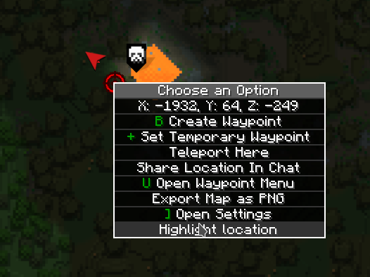
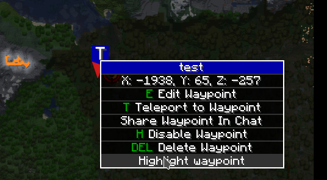
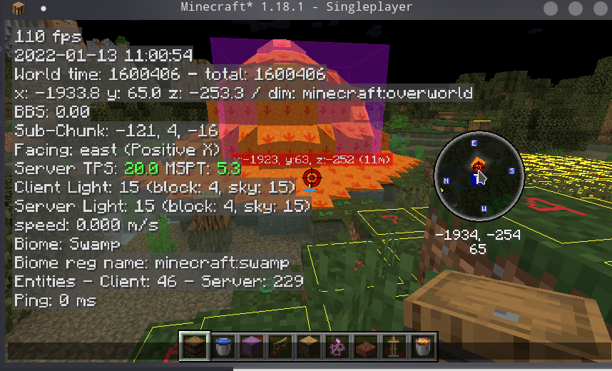

# Xaero Map Addition

❗Before reporting a problem, be sure to try the latest [beta version](https://github.com/plusls/xaero-map-addition/actions) to check if the problem still exists.

♻️Note: Minecraft 1.20 requires the use of a third-party port [Malilib](https://github.com/Nyan-Work/malilib/releases/tag/1.20).

## Deps

+ Oh My Minecraft Client
+ Xaero World Map
+ Xaero Mini Map
+ Magiclib https://github.com/Hendrix-Shen/MagicLib
## Features

### Chinese Translation

Add Chinese translation from https://www.bilibili.com/read/cv11613668

### Support highlight waypoint

Support highlight waypoint in world map, and can render highlight waypoint in minimap.

Highlight location:

Highlight waypoint:

Sync highlight waypoint from ommc:

